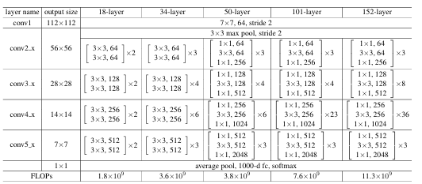

# ResNet-34 Implementation (He et al.)

This repository contains a faithful reproduction of the **ResNet architecture** from the paper *Deep Residual Learning for Image Recognition* by He et al. The key idea behind ResNets is the use of **skip (residual) connections**, which mitigate vanishing and exploding gradient problems and enable the effective training of very deep networks.

---

## Overview

This project implements the **CIFAR-10 variant of ResNet-34**, trained completely from scratch. The network begins with an initial convolution layer followed by multiple stacks of **residual blocks**, each containing two 3×3 convolution layers. Residual connections allow gradients to flow directly through the network, leading to faster and more stable convergence.

### Architecture Highlights
- Initial convolution layer
- Three stacks of residual blocks with increasing channel depth
- Each residual block contains **two 3×3 convolution layers**
- Batch Normalization and ReLU after each convolution
- Single fully connected (linear) layer for classification

**ResNet Architecture Comparison (He et al.)**



- **Input image size:** 224×224

---

## Dataset

**CIFAR-10 Dataset**

- 60,000 RGB images of size 32×32  
- Images resized to **224×224** during preprocessing  
- 50,000 training images  
- 10,000 test images  

---

## Training

Training was performed on a **T4 GPU** with the following configuration:

- **Optimizer:** SGD  
- **Learning rate:** 0.1  
- **Momentum:** 0.9  
- **Loss function:** Cross-Entropy Loss  
- **Epochs trained:** 18 (EarlyStopping applied)  
- **Learning rate scheduling:** Reduce-on-Plateau  

Training stopped early once validation performance saturated.

---

## Results

- **Final Test Accuracy:** 85.27%  
- **Final Test Loss:** 0.52  

Although the accuracy is lower than the ~92% reported in the original ResNet paper, this is
expected due to:
- Fewer training epochs
- Minimal data augmentation
- CIFAR-10-specific architectural adjustments

Despite these constraints, the model demonstrates strong convergence and stable optimization.

---


## Usage

Train the model using:

```bash
python train.py models/resnet34.py 
```


## My Observations

- Batch normalization at every layer and residual connections significantly improve training stability and convergence speed.
- The model achieved **~100% training accuracy (99.78% in this implementation)**.
- Convolutional layers primarily act as feature extractors, while the linear layer performs classification

---


## Citations

[Deep Residual Learning for Image Recognition (arXiv 1512.03385)](https://arxiv.org/abs/1512.03385)


